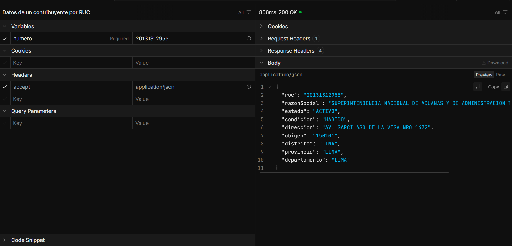

# API de consulta de RUC y DNI (Perú)

API que recibe un RUC o un DNI, comprueba que el número sea válido y devuelve los datos del contribuyente
o de la persona. Los números mal escritos se rechazan sin consultar a nadie, y cada resultado se guarda
un tiempo para no repetir la misma consulta. Si el servicio externo falla, la respuesta lo dice
claramente en lugar de decir que el número es inválido.



## Cómo ejecutarlo

Requisito: [SDK de .NET 9](https://dotnet.microsoft.com/download/dotnet/9.0). No necesita token ni base de datos.

```bash
git clone https://github.com/rmm-01/consulta-ruc-pe.git
cd consulta-ruc-pe
dotnet run --project src/ConsultaRuc.Api --launch-profile http
```

Abrir `http://localhost:5085` en el navegador: redirige a Scalar, donde se pueden probar los endpoints.

## Endpoints

### `GET /ruc/{numero}`

```json
{
  "ruc": "20131312955",
  "razonSocial": "SUPERINTENDENCIA NACIONAL DE ADUANAS Y DE ADMINISTRACION TRIBUTARIA - SUNAT",
  "estado": "ACTIVO",
  "condicion": "HABIDO",
  "direccion": "AV. GARCILASO DE LA VEGA NRO 1472",
  "ubigeo": "150101",
  "distrito": "LIMA",
  "provincia": "LIMA",
  "departamento": "LIMA"
}
```

### `GET /dni/{numero}`

```json
{ "dni": "12345678", "nombres": "ANA MARIA", "apellidoPaterno": "QUISPE", "apellidoMaterno": "ROJAS", "nombreCompleto": "ANA MARIA QUISPE ROJAS" }
```

Los dos endpoints responden con el mismo criterio:

| Código | Cuándo |
|---|---|
| 200 | El documento existe |
| 400 | El número no es válido. No se consulta al servicio externo |
| 404 | El número es válido, pero no está registrado |
| 503 | El servicio externo no respondió, limitó las consultas o devolvió algo inesperado |

Los errores usan el formato estándar *Problem Details* (RFC 9457). Ejemplo de un 400:

```json
{ "title": "One or more validation errors occurred.", "status": 400,
  "errors": { "numero": ["El dígito verificador del RUC no es correcto."] } }
```

## Decisiones técnicas

**El RUC se valida antes de consultar.** Se revisan la longitud, el prefijo (10, 15, 16, 17 o 20) y el
dígito verificador. El dígito se calcula con módulo 11: cada uno de los 10 primeros dígitos se
multiplica por los pesos 5, 4, 3, 2, 7, 6, 5, 4, 3, 2. Un RUC con un dígito cambiado se rechaza al
instante y no gasta consultas del servicio externo. El DNI no tiene dígito verificador público, así que
solo se valida que tenga 8 dígitos.

**"Número inválido" y "servicio no disponible" son respuestas distintas.** Cada consulta al servicio
externo tiene tres resultados posibles:
- los datos;
- `null` si el documento no existe (404 del servicio);
- `ServicioNoDisponibleException` si no se pudo averiguar.

Un 429, un 5xx, un tiempo de espera agotado o un JSON roto terminan en 503. Ninguno de esos casos
termina en 400. Decirle al usuario que su RUC es inválido porque el servicio estaba caído sería
información falsa.

**Caché en memoria que envuelve al cliente.** `ConsultaConCache` implementa la misma interfaz que el
cliente HTTP (`IConsultaProveedor`) y lo envuelve. Los endpoints no saben si la respuesta viene de la
caché.
- Un documento encontrado se guarda 24 horas: los datos de un RUC o un DNI cambian poco.
- Un "no existe" se guarda 1 hora, para que un RUC recién inscrito aparezca pronto.
- Los errores no se guardan, así que la siguiente consulta vuelve a intentar.

**"No existe" también se guarda.** `IMemoryCache` no distingue entre "guardé `null`" y "no hay nada
guardado". Por eso cada valor se guarda dentro de un envoltorio. Sin ese envoltorio, consultar muchas
veces un número inexistente llamaría siempre al servicio externo.

**La caché tiene un tamaño máximo.** Sin límite, alguien que consulte miles de números distintos
llenaría la memoria del servidor. `MaxEntradas` (10 000 por defecto) limita cuántos documentos se
guardan.

**Configuración validada al iniciar.** Las duraciones y el tamaño máximo se leen de la sección `Cache`
de `appsettings.json`. Un valor en cero o negativo detiene la API al arrancar (`ValidateOnStart`), en
lugar de fallar en la primera consulta.

```json
"Cache": { "DuracionEncontrado": "1.00:00:00", "DuracionNoEncontrado": "01:00:00", "MaxEntradas": 10000 }
```

**Fuente de datos: apis.net.pe v1.** Es gratuita y no requiere token, pero limita la cantidad de
consultas seguidas. Cuando se supera el límite responde 429 con una página HTML. El cliente revisa el
código de estado antes de leer el cuerpo y lo convierte en 503. Este límite es una de las razones de
la caché.

**El detalle del error interno no llega al cliente.** El 503 dice "no se pudo consultar, intente más
tarde". El motivo real (por ejemplo, el 429) queda en el log. Así se puede cambiar de proveedor sin
cambiar las respuestas de la API.

**La documentación interactiva (Scalar) solo existe en desarrollo.** En producción, `/scalar` y
`/openapi/v1.json` responden 404.

### Qué quedó fuera

- **Proveedor de respaldo.** Un segundo servicio (por ejemplo, uno con token) que responda cuando
  apis.net.pe devuelve 429. Se puede agregar con el mismo patrón de envoltorio que la caché.
- **Consultas simultáneas del mismo número.** Si llegan varias peticiones a la vez por un número que no
  está en caché, todas van al servicio externo. `HybridCache` (.NET 9) agrupa esas peticiones, pero no
  permite elegir la duración según el resultado. Por eso se usó `IMemoryCache`.
- **Caché compartida entre servidores** (por ejemplo, Redis). Con una sola instancia, la memoria basta.
- **Límite de peticiones por cliente** para proteger la cuota del servicio externo.

## Estructura

```
src/
  ConsultaRuc.Core/   Validador, modelos, cliente de apis.net.pe y caché (sin dependencia de ASP.NET)
  ConsultaRuc.Api/    Minimal API, configuración e inyección de dependencias
tests/
  ConsultaRuc.Tests/  Pruebas con xUnit
```

## Pruebas

```bash
dotnet test
```

72 pruebas, sin acceso a internet:

- **Validador:** RUC válidos (incluido el caso en que el dígito resulta 10 u 11), prefijos inexistentes,
  dígito incorrecto, letras, dígitos de otros alfabetos y longitudes incorrectas.
- **Cliente HTTP:** 404, 429 con HTML, errores 5xx, tiempo de espera agotado, cancelación y JSON roto.
  Se simulan con un `HttpMessageHandler` falso.
- **Caché:** usa un reloj manual para comprobar el vencimiento a las 24 horas y a la hora sin esperar.
  También comprueba que los errores no se guardan y que un RUC y un DNI con los mismos dígitos no se
  mezclan.
- **Endpoints:** levantan la API en memoria con `WebApplicationFactory` y comprueban cada código HTTP.
  También comprueban que un número inválido no llega al servicio externo. Dos pruebas recorren la
  cadena completa (endpoint, caché y cliente) con solo la red simulada.

## Fuentes

- [apis.net.pe](https://apis.net.pe): consulta de RUC y DNI.
- Los datos de ejemplo son el RUC público de SUNAT (20131312955) y una persona inventada.

## Licencia

[MIT](LICENSE)
